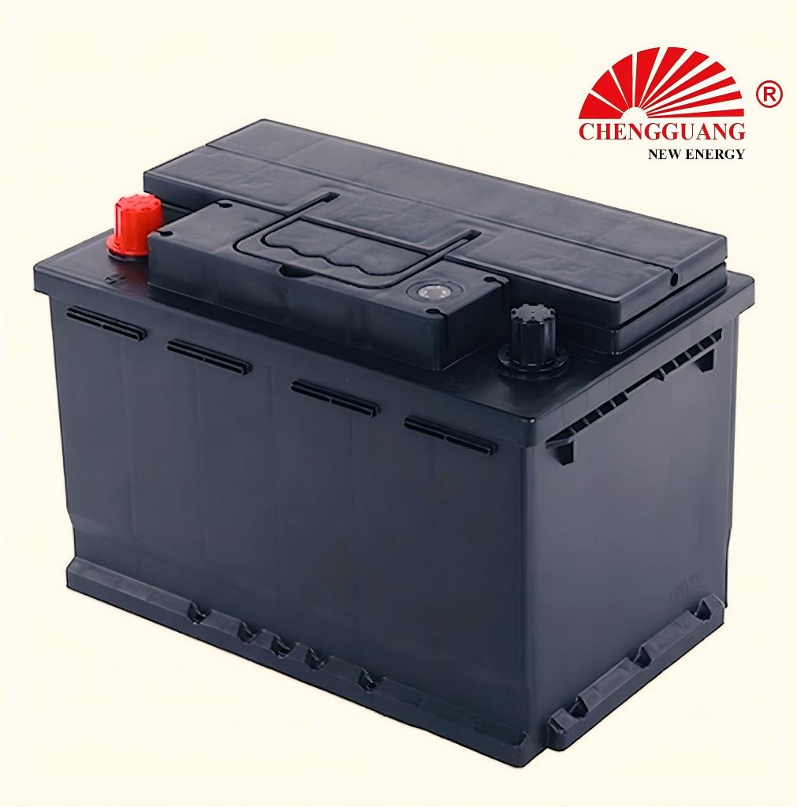

# 56638 Battery — DIN66 / 566.38

56638 (DIN66/566.38) is a **DIN SLI** automotive battery specification.

## Technical Specifications

| Parameter | Specification |
|---|---|
| **Model** | 56638 |
| **Aliases** | DIN66, 566.38 |
| **Standard** | DIN |
| **Battery Type** | SLI |
| **Nominal Voltage** | 12 V |
| **Capacity (C20)** | 66 Ah |
| **CCA Rating** | 540 A (SAE) |
| **Dimensions (LxWxH)** | 278 x 175 x 175-190 mm |
| **Terminal Type** | T1 (DIN standard) |
| **Polarity** | L- R+ [0] |
| **Hold-Down** | B13 |
| **Approximate Weight** | 15-18 kg |

!!! warning "Data Verification: RANGE_ONLY"
    Specifications are provided as ranges. Exact per-unit values should be confirmed with the manufacturer.

## Applications

European compact-to-mid sedans, hatchbacks

### Vehicle Fitment

European-market passenger vehicles (DIN66 spec)

## Markets

Europe, Middle East, Africa

## Equivalent Models

| Model | Standard | Relationship | Confidence |
|-------|----------|-------------|------------|
| **DIN66** | DIN | Alias | High |
| **566.38** | DIN | Alias | High |

!!! note "Equivalent != Identical"
    Different model designations may indicate different specifications (capacity, CCA) even within the same case size. Always verify specifications before substituting.

## OEM Availability

This model is available for **OEM / private label manufacturing** from Chengguang Power Tech.

- IATF 16949 certified manufacturing
- Custom label, packaging, and terminal options
- Full batch traceability
- Pre-shipment inspection with CCA and capacity testing

[Request OEM Quote](https://chengguangenergy.com/contact/)

---

*Last verified: 2026-08-11 | Source: Chengguang Power Tech product documentation | SKU: CG-DIN-56638*
