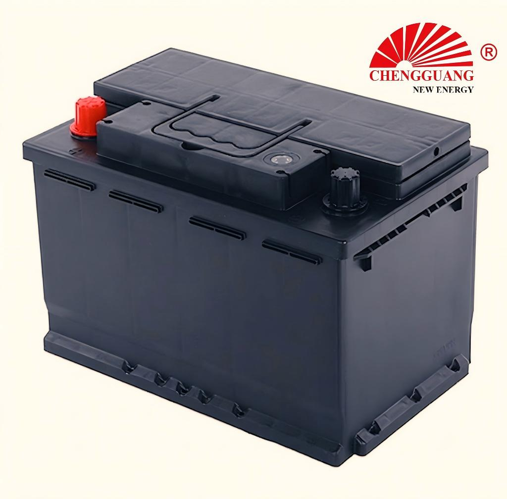

# 57117 Battery — DIN70

The 57117 (DIN70) is a mid-range DIN battery for European vehicles requiring 70Ah capacity. It sits between the entry-level DIN66 (66Ah) and the larger DIN72/75 models. Full technical specifications are pending factory verification — contact Chengguang for your order's exact specs.

## Quick Reference

| Parameter | Specification |
|---|---|
| **Model** | 57117 |
| **Also Known As** | DIN70 |
| **Standard** | DIN (Deutsches Institut fur Normung) |
| **Battery Type** | SLI (Starting, Lighting, Ignition) |
| **Nominal Voltage** | 12 V |
| **Capacity (C20)** | 70 Ah |
| **CCA Rating** | TBD — Pending Factory Verification |
| **Dimensions (LxWxH)** | TBD — Pending Factory Verification |
| **Terminal Type** | Standard DIN post |
| **Polarity** | Left Negative (-), Right Positive (+) — DIN type [0] |
| **Hold-Down** | B13 (bottom rail) |
| **Approximate Weight** | TBD |
| **Chengguang SKU** | CG-DIN-57117 |

!!! warning "Specification Ranges"
    Values shown are typical ranges. Exact specifications vary by production batch. Contact Chengguang for your order's technical data sheet. CCA values marked "TBD" are pending factory verification.

## How to Identify This Battery

Standard DIN case with B13 bottom rail hold-down and DIN standard post terminals. Label shows '57117' or 'DIN70'. Distinguish from DIN66 by checking the Ah rating on the label (70 vs 66).

## Vehicle Applications

European mid-size sedans and SUVs requiring DIN70 specification — the step up from DIN66 for vehicles with higher electrical demands.

### Compatible Vehicles

- European-market vehicles requiring DIN70 specification. Contact Chengguang for specific vehicle compatibility data.

!!! note "Fitment Verification"
    Vehicle fitment is a general guide. Always verify tray dimensions, B13 bottom rail fit, terminal position, and DIN post diameter. DIN batteries use B13 (bottom rail lip) hold-down — NOT compatible with JIS B00 (top frame) without an adapter.

## Regional Markets

Europe, Middle East, Africa — markets with European vehicle fleets.

## Manufacturing at Chengguang

DIN-standard automated line. IATF 16949 certified. Full specifications pending compilation from factory technical documentation.

## Testing & Quality Control

100%: CCA (SAE J537), OCV, visual. Batch: per EN 50342-1. Full test data available with production orders.

## Related Battery Models

- DIN66/56638 — smaller capacity (66Ah)
- DIN72/57219 — next capacity tier
- 65D26 — JIS equivalent segment

## Equivalent Models & Cross-Reference

| Model | Standard | Relationship | Confidence |
|-------|----------|-------------|------------|
| **DIN70** | DIN | Alias / Same case | :material-check: High |

!!! warning "DIN vs JIS — Not Interchangeable"
    DIN batteries use B13 bottom rail hold-down and standard post terminals. JIS batteries use B00 top frame and T1 posts. Even when dimensions are similar, the hold-down mechanism and terminal type differ. Always verify your vehicle's battery mounting system.

## OEM & Private Label Availability

Available for **OEM manufacturing** under your brand from Chengguang Power Tech:

- IATF 16949:2016 certified manufacturing in Jinzhou, Hebei, China
- Custom label (including European regulatory markings), case color, packaging
- Full batch traceability — raw material lot to shipping container
- 100% pre-shipment CCA and capacity testing with CoA
- DG-compliant export packaging (UN 2794 / Class 8)
- CE marking documentation for EU import

[Request OEM Quote](https://chengguangenergy.com/contact/){{ .md-button }} [View OEM Process](https://oem.chengguangenergy.com/oem-process/){{ .md-button }}

## Frequently Asked Questions

### When will full specs be available?

Factory technical documentation is being compiled. Contact Chengguang sales for preliminary specifications and to request your order's exact data sheet.

### What is the difference between DIN70 and DIN66?

DIN70 has higher capacity (70 vs 66 Ah). Physical dimensions are typically similar or identical — the difference is internal (plate count/paste density). Verify dimensions for your specific vehicle.

---

*Last verified: 2026-08-11 | Source: Chengguang Power Tech Co., Ltd. | SKU: CG-DIN-57117 | Manufactured in Jinzhou, Hebei, China*

*Author: Chengguang Power Tech Technical Team | Reviewed: IATF 16949 Quality Department | [Technical Reference](https://technical.chengguangenergy.com/)*
