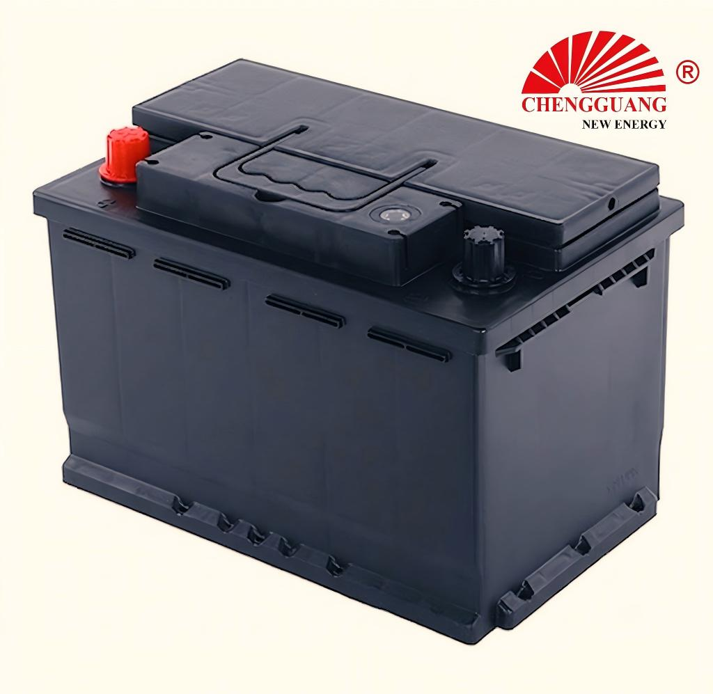

# 57219 Battery — DIN72

The 57219 (DIN72) serves European vehicles requiring 72Ah capacity. Full specifications pending factory verification.

## Quick Reference

| Parameter | Specification |
|---|---|
| **Model** | 57219 |
| **Also Known As** | DIN72 |
| **Standard** | DIN |
| **Battery Type** | SLI |
| **Nominal Voltage** | 12 V |
| **Capacity (C20)** | 72 Ah |
| **CCA Rating** | NEEDS VERIFICATION |
| **Dimensions (LxWxH)** | NEEDS VERIFICATION |
| **Terminal Type** | Standard DIN post |
| **Polarity** | Left (-), Right (+) — DIN [0] |
| **Hold-Down** | B13 (bottom rail) |
| **Approximate Weight** | NEEDS VERIFICATION |
| **Chengguang SKU** | CG-DIN-57219 |

!!! warning "Specification Ranges"
    Exact specifications vary by production batch and customer requirement. Contact Chengguang for your order's technical data sheet.

## How to Identify This Battery

Standard DIN case with B13 bottom rail. Label shows '57219' or 'DIN72'.

## Vehicle Applications

European mid-to-large sedans requiring DIN72 specification.

### Compatible Vehicles

Contact Chengguang for verified vehicle fitment data.

!!! note "Fitment Verification"
    Vehicle fitment is a general guide. Always verify tray dimensions, terminal position, and hold-down type.

## Regional Markets

Europe, Middle East, Africa.

## Manufacturing at Chengguang

DIN-standard line. Specifications pending verification.

## Testing & Quality Control

100%: CCA, OCV, visual. Batch: per EN 50342-1.

## Related Battery Models

- DIN70/57117 — smaller capacity
- DIN75/57412 — next size up

## Equivalent Models & Cross-Reference

| Model | Standard | Relationship | Confidence |
|-------|----------|-------------|------------|
| **DIN72** | DIN | Alias / Same case | High |

!!! warning "Equivalent Does Not Mean Identical"
    Different model designations may indicate different specifications. Cross-standard equivalents are dimensional approximations only.

## OEM & Private Label Availability

Available for **OEM manufacturing** under your brand from Chengguang Power Tech (IATF 16949 certified):

[Request OEM Quote](https://chengguangenergy.com/contact/){ .md-button }

## Frequently Asked Questions

### Specifications?

Pending factory verification. Contact Chengguang for preliminary data.

---

*Last verified: 2026-08-11 | Source: Chengguang Power Tech Co., Ltd. | SKU: CG-DIN-57219 | Jinzhou, Hebei, China*

*Author: Chengguang Power Tech Technical Team | Reviewed: IATF 16949 Quality Department*
