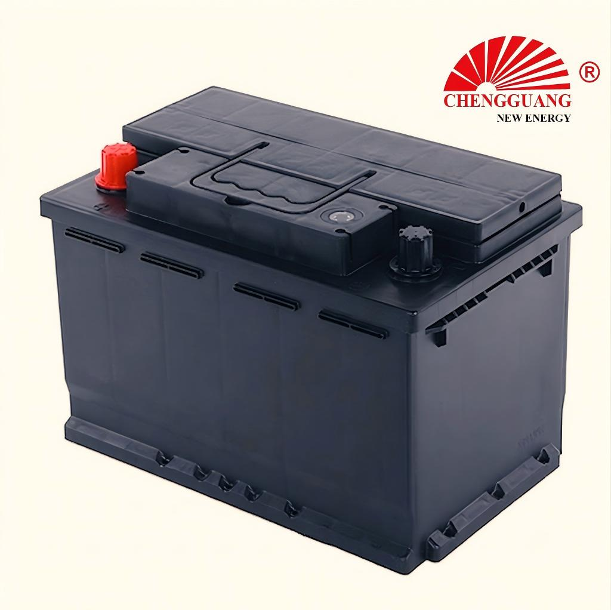

# 57412/57413 Battery — DIN75

The 57412/57413 (DIN75) serves European vehicles requiring 75Ah capacity. Two sub-variants (57412 and 57413) exist — likely differing in terminal configuration or polarity layout. Contact Chengguang to confirm which variant matches your vehicle.

## Quick Reference

| Parameter | Specification |
|---|---|
| **Model** | 57412/57413 |
| **Also Known As** | DIN75 |
| **Standard** | DIN |
| **Battery Type** | SLI |
| **Nominal Voltage** | 12 V |
| **Capacity (C20)** | 75 Ah |
| **CCA Rating** | 660 CCA (EN) |
| **Dimensions (LxWxH)** | TBD — Pending Verification |
| **Terminal Type** | Standard DIN post |
| **Polarity** | Left (-), Right (+) — DIN type [0] |
| **Hold-Down** | B13 (bottom rail) |
| **Approximate Weight** | TBD |
| **Chengguang SKU** | CG-DIN-57412 |

!!! warning "Partial Data — Factory Verification Pending"
    Specifications marked "TBD" are being compiled from factory technical documentation. Contact Chengguang for your order's exact data sheet.

## How to Identify This Battery

Standard DIN case with B13 bottom rail. Two numeric variants: 57412 and 57413. These may indicate different terminal types (standard vs. reversed post size) or polarity configurations (L-/R+ vs. L+/R-). Verify with the Chengguang technical team which variant you need.

## Vehicle Applications

European large sedans and SUVs requiring 75Ah capacity.

- European-market vehicles requiring DIN75. Contact Chengguang for vehicle-specific data.

!!! note "Fitment + DIN vs JIS"
    Vehicle fitment is a general guide. DIN batteries use B13 bottom rail hold-down — NOT compatible with JIS B00 top frame. Always verify your vehicle's battery mounting system.

## Regional Markets

Europe, Middle East, Africa.

## Manufacturing at Chengguang

DIN-standard line. IATF 16949 certified. Sub-variant specifications being verified.

## Testing & Quality Control

100%: CCA, OCV, visual. Batch: per EN 50342-1.

## Related Battery Models

- DIN72/57219 — lower capacity
- DIN80/58043 — next tier (80Ah, 315 mm)
- DIN66/56638 — entry level

## Equivalent Models & Cross-Reference

| Model | Standard | Relationship | Confidence |
|-------|----------|-------------|------------|
| **DIN75** | DIN | Alias | :material-check: High |

!!! warning "DIN vs JIS — Not Directly Interchangeable"
    Different hold-down (B13 vs B00), terminal type, and case dimensions. Always verify your vehicle's requirements.

## OEM & Private Label Availability

Available for **OEM manufacturing** under your brand from Chengguang Power Tech:

- IATF 16949:2016 certified manufacturing in Jinzhou, Hebei, China
- Custom label, packaging, terminal options
- Full batch traceability
- CE marking documentation for EU import

[Request OEM Quote](https://chengguangenergy.com/contact/){{ .md-button }}

## Frequently Asked Questions

### 57412 vs 57413?

Likely polarity or terminal variants. Check your vehicle manual for required terminal orientation before ordering.

### Dimensions?

Mid-range DIN — typically around 278-315 mm length. Exact dimensions pending factory verification.

---

*Last verified: 2026-08-11 | Source: Chengguang Power Tech | SKU: CG-DIN-57412 | Jinzhou, Hebei, China*

*Author: Chengguang Power Tech Technical Team | Reviewed: IATF 16949 Quality Department*
