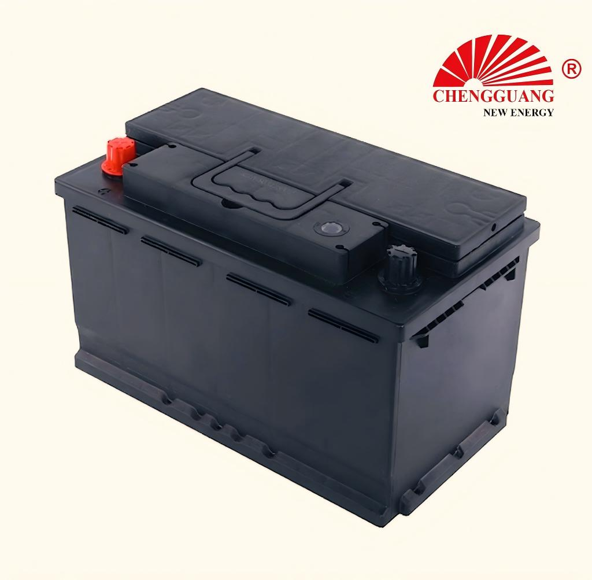

# 58043 Battery — DIN80

The 58043 (DIN80) is a large DIN battery for European luxury vehicles and light trucks. Dimensions confirmed: 315 x 175 mm. CCA pending verification.

## Quick Reference

| Parameter | Specification |
|---|---|
| **Model** | 58043 |
| **Also Known As** | DIN80 |
| **Standard** | DIN |
| **Battery Type** | SLI |
| **Nominal Voltage** | 12 V |
| **Capacity (C20)** | 80 Ah |
| **CCA Rating** | NEEDS VERIFICATION |
| **Dimensions (LxWxH)** | 315 x 175 x 175-190 mm |
| **Terminal Type** | Standard DIN post |
| **Polarity** | Left (-), Right (+) — DIN [0] |
| **Hold-Down** | B13 (bottom rail) |
| **Approximate Weight** | NEEDS VERIFICATION |
| **Chengguang SKU** | CG-DIN-58043 |

!!! warning "Specification Ranges"
    Exact specifications vary by production batch and customer requirement. Contact Chengguang for your order's technical data sheet.

## How to Identify This Battery

Large DIN case (315 mm long). B13 bottom rail. Label shows '58043' or 'DIN80'. Longer than DIN66 (278 mm) and DIN100 (393 mm).

## Vehicle Applications

European large sedans, luxury SUVs, light commercial vehicles.

### Compatible Vehicles

European-market premium vehicles — contact Chengguang for specific fitment.

!!! note "Fitment Verification"
    Vehicle fitment is a general guide. Always verify tray dimensions, terminal position, and hold-down type.

## Regional Markets

Europe, Middle East, Africa — premium vehicle segment.

## Manufacturing at Chengguang

DIN-standard line. CCA specifications pending factory verification.

## Testing & Quality Control

100%: CCA, OCV, visual. Batch: per EN 50342-1.

## Related Battery Models

- DIN75/57412 — smaller
- DIN88/58827 — next size up (longer case)
- 105D31 — JIS equivalent segment

## Equivalent Models & Cross-Reference

| Model | Standard | Relationship | Confidence |
|-------|----------|-------------|------------|
| **DIN80** | DIN | Alias / Same case | High |

!!! warning "Equivalent Does Not Mean Identical"
    Different model designations may indicate different specifications. Cross-standard equivalents are dimensional approximations only.

## OEM & Private Label Availability

Available for **OEM manufacturing** under your brand from Chengguang Power Tech (IATF 16949 certified):

[Request OEM Quote](https://chengguangenergy.com/contact/){ .md-button }

## Frequently Asked Questions

### DIN80 dimensions?

315 x 175 x 175-190 mm. CCA pending factory data.

---

*Last verified: 2026-08-11 | Source: Chengguang Power Tech Co., Ltd. | SKU: CG-DIN-58043 | Jinzhou, Hebei, China*

*Author: Chengguang Power Tech Technical Team | Reviewed: IATF 16949 Quality Department*
