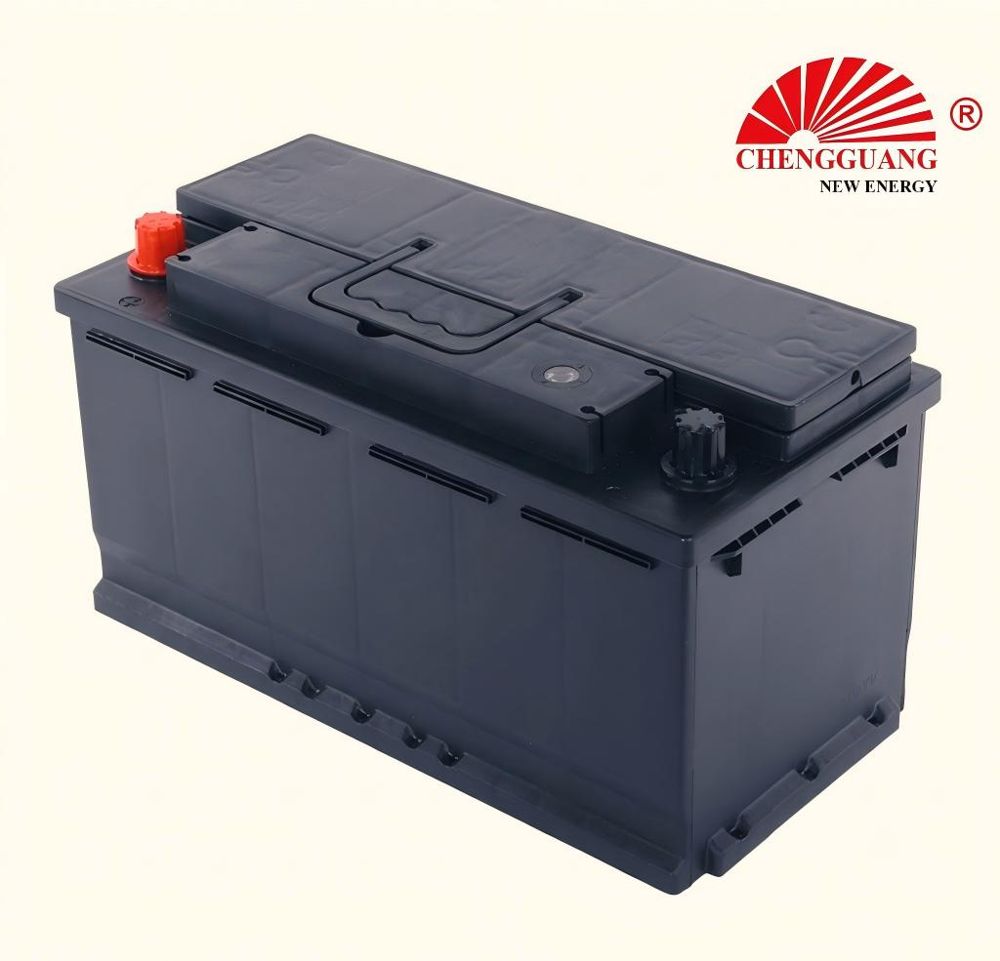

# 58827 Battery — DIN88

The 58827 (DIN88) is a large-capacity DIN battery — 88Ah in a 353 mm case. It serves European luxury vehicles requiring more power than DIN80 but in a shorter case than the flagship DIN100 (393 mm). Case dimensions confirmed; CCA pending factory verification.

## Quick Reference

| Parameter | Specification |
|---|---|
| **Model** | 58827 |
| **Also Known As** | DIN88 |
| **Standard** | DIN |
| **Battery Type** | SLI |
| **Nominal Voltage** | 12 V |
| **Capacity (C20)** | 88 Ah |
| **CCA Rating** | TBD — Pending Verification |
| **Dimensions (LxWxH)** | 353 x 175 x 175-190 mm |
| **Terminal Type** | Standard DIN post |
| **Polarity** | Left (-), Right (+) — DIN type [0] |
| **Hold-Down** | B13 (bottom rail) |
| **Approximate Weight** | TBD |
| **Chengguang SKU** | CG-DIN-58827 |

!!! warning "Partial Data — Factory Verification Pending"
    Specifications marked "TBD" are being compiled from factory technical documentation. Contact Chengguang for your order's exact data sheet.

## How to Identify This Battery

Large DIN case: 353 mm long x 175 mm wide. B13 bottom rail. Longer than DIN80 (315 mm) but shorter than DIN100 (393 mm). The 353 mm length is distinctive — measure your tray to distinguish between DIN88 and DIN100.

## Vehicle Applications

European large luxury sedans, full-size SUVs, high-specification diesel vehicles. The preferred DIN size for many European premium models.

- European-market large luxury and diesel vehicles. Contact Chengguang for model-specific compatibility.

!!! note "Fitment + DIN vs JIS"
    Vehicle fitment is a general guide. DIN batteries use B13 bottom rail hold-down — NOT compatible with JIS B00 top frame. Always verify your vehicle's battery mounting system.

## Regional Markets

Europe (luxury/diesel segment), Middle East (European luxury imports), Africa (premium segment).

## Manufacturing at Chengguang

DIN-standard large-frame line. Case dimensions confirmed. CCA pending factory compilation.

## Testing & Quality Control

100%: CCA, OCV, visual. Batch: per EN 50342-1.

## Related Battery Models

- DIN80/58043 — shorter (315 mm, 80Ah)
- DIN100/60038 — longer (393 mm, 100Ah)
- 95E41 — JIS large-capacity equivalent (410 mm, B00 hold-down — verify fit)

## Equivalent Models & Cross-Reference

| Model | Standard | Relationship | Confidence |
|-------|----------|-------------|------------|
| **DIN88** | DIN | Alias | :material-check: High |

!!! warning "DIN vs JIS — Not Directly Interchangeable"
    Different hold-down (B13 vs B00), terminal type, and case dimensions. Always verify your vehicle's requirements.

## OEM & Private Label Availability

Available for **OEM manufacturing** under your brand from Chengguang Power Tech:

- IATF 16949:2016 certified manufacturing in Jinzhou, Hebei, China
- Custom label, packaging, terminal options
- Full batch traceability
- CE marking documentation for EU import

[Request OEM Quote](https://chengguangenergy.com/contact/){{ .md-button }}

## Frequently Asked Questions

### DIN88 vs DIN100?

DIN88: 353 mm, 88Ah. DIN100: 393 mm, 100Ah. The 40 mm length difference is critical — measure your tray.

### DIN88 dimensions?

353 x 175 x 175-190 mm. CCA pending. Contact Chengguang for preliminary electrical specs.

---

*Last verified: 2026-08-11 | Source: Chengguang Power Tech | SKU: CG-DIN-58827 | Jinzhou, Hebei, China*

*Author: Chengguang Power Tech Technical Team | Reviewed: IATF 16949 Quality Department*
