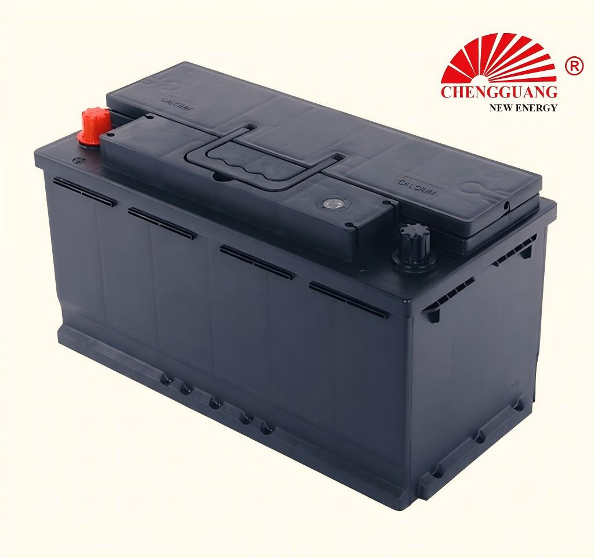

# 60038 Battery — DIN100, 600.38

The 60038 (DIN100) is the largest DIN battery in the Chengguang range — a 100Ah, 870 CCA powerhouse for European luxury vehicles, high-spec diesels, and light commercial applications. At 393 mm long, it is the longest DIN passenger car battery Chengguang manufactures.

## Quick Reference

| Parameter | Specification |
|---|---|
| **Model** | 60038 |
| **Also Known As** | DIN100, 600.38 |
| **Standard** | DIN (Deutsches Institut fur Normung) |
| **Battery Type** | SLI (Starting, Lighting, Ignition) |
| **Nominal Voltage** | 12 V |
| **Capacity (C20)** | 100 Ah |
| **CCA Rating** | 870 A (SAE) |
| **Dimensions (LxWxH)** | 393 x 175 x 175-190 mm |
| **Terminal Type** | Standard DIN post |
| **Polarity** | Left Negative (-), Right Positive (+) — DIN type [0] |
| **Hold-Down** | B13 (bottom rail) |
| **Approximate Weight** | 22-26 kg |
| **Chengguang SKU** | CG-DIN-60038 |

!!! warning "Specification Ranges"
    Values shown are typical ranges. Exact specifications vary by production batch. Contact Chengguang for your order's technical data sheet. CCA values marked "TBD" are pending factory verification.

## How to Identify This Battery

Longest DIN case (393 mm). B13 bottom rail. DIN standard post terminals. Label shows '60038', 'DIN100', or '600.38'. Significantly longer than DIN66 (278 mm) and DIN80 (315 mm). The 393 mm length is the key identifier.

## Vehicle Applications

European large luxury sedans and SUVs, high-specification diesel vehicles requiring 100Ah+ capacity. Light commercial vehicles (VW Transporter, Mercedes Sprinter auxiliary).

### Compatible Vehicles

- Audi: A6, A8, Q7, Q8 (large diesel)
- BMW: 5 Series, 7 Series, X5, X6 (diesel)
- Mercedes-Benz: E-Class, S-Class, GLE, GLS (diesel)
- VW: Touareg, Phaeton
- Porsche: Cayenne (diesel)
- Light commercial: VW Transporter, Mercedes Sprinter (auxiliary battery)

!!! note "Fitment Verification"
    Vehicle fitment is a general guide. Always verify tray dimensions, B13 bottom rail fit, terminal position, and DIN post diameter. DIN batteries use B13 (bottom rail lip) hold-down — NOT compatible with JIS B00 (top frame) without an adapter.

## Regional Markets

Europe (premium/diesel segment), Middle East (European luxury imports), Africa (West/North — European vehicle segment). Premium market positioning.

## Manufacturing at Chengguang

DIN-standard large-frame line. Optimized Ca-Ca grids for high-rate discharge (870 CCA). Increased plate count vs smaller DIN batteries. Output: 1,000-1,500 units/day.

## Testing & Quality Control

100%: CCA (SAE J537, >870A), OCV, high-rate discharge, visual. Batch: C20 (IEC 60095-1), RC (SAE J537), charge acceptance (EN 50342-1), vibration (EN 50342-1), thermal cycling.

## Related Battery Models

- DIN88/58827 — slightly shorter (353 mm, 88Ah)
- DIN80/58043 — much shorter (315 mm, 80Ah)
- 95E41 — JIS 100Ah equivalent (410 mm, B00 hold-down — verify fit)
- 145G51 — heavy duty commercial, NOT a passenger car replacement

## Equivalent Models & Cross-Reference

| Model | Standard | Relationship | Confidence |
|-------|----------|-------------|------------|
| **DIN100** | DIN | Alias / Same case | :material-check: High |
| **600.38** | DIN | Alias / Same case | :material-check: High |

!!! warning "DIN vs JIS — Not Interchangeable"
    DIN batteries use B13 bottom rail hold-down and standard post terminals. JIS batteries use B00 top frame and T1 posts. Even when dimensions are similar, the hold-down mechanism and terminal type differ. Always verify your vehicle's battery mounting system.

## OEM & Private Label Availability

Available for **OEM manufacturing** under your brand from Chengguang Power Tech:

- IATF 16949:2016 certified manufacturing in Jinzhou, Hebei, China
- Custom label (including European regulatory markings), case color, packaging
- Full batch traceability — raw material lot to shipping container
- 100% pre-shipment CCA and capacity testing with CoA
- DG-compliant export packaging (UN 2794 / Class 8)
- CE marking documentation for EU import

[Request OEM Quote](https://chengguangenergy.com/contact/){{ .md-button }} [View OEM Process](https://oem.chengguangenergy.com/oem-process/){{ .md-button }}

## Frequently Asked Questions

### DIN100 vs 95E41?

Both ~100Ah but different standards. DIN100: 393 mm, B13 bottom rail. 95E41: 410 mm, B00 top frame. Not interchangeable. Check your vehicle's hold-down type.

### What vehicles need DIN100?

Large European luxury diesels — Audi A8, BMW 7 Series, Mercedes S-Class. Also used in some light commercial vehicles as the main or auxiliary battery.

### Is DIN100 suitable for trucks?

This is a passenger car / light commercial battery — not a heavy-duty truck battery. For commercial trucks, use JIS heavy-duty models (145G51, 190H52) or contact Chengguang for DIN commercial vehicle options.

### CCA comparison with JIS?

DIN100 CCA is 870A (SAE). Equivalent JIS ~100Ah batteries (95E41, 105D31) deliver 650-750A. The higher CCA reflects European cold-climate requirements.

---

*Last verified: 2026-08-11 | Source: Chengguang Power Tech Co., Ltd. | SKU: CG-DIN-60038 | Manufactured in Jinzhou, Hebei, China*

*Author: Chengguang Power Tech Technical Team | Reviewed: IATF 16949 Quality Department | [Technical Reference](https://technical.chengguangenergy.com/)*
