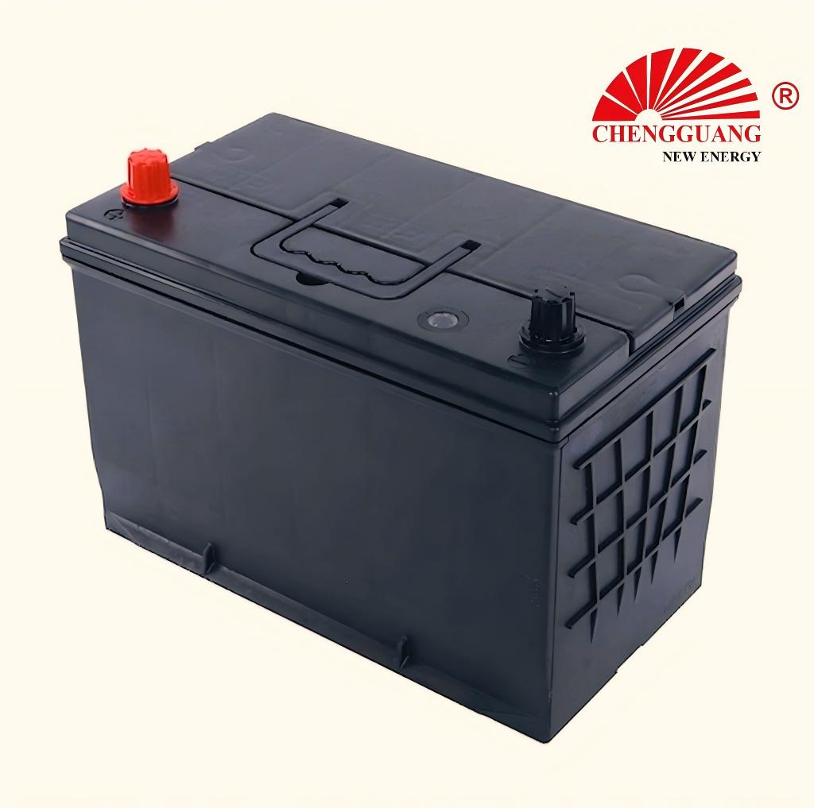

# 105D31 Battery — 95D31 / 65D31 / N90 / N80 / N70

105D31 (95D31/65D31/N90/N80/N70) is a **JIS SLI** automotive battery specification.

## Technical Specifications

| Parameter | Specification |
|---|---|
| **Model** | 105D31 |
| **Aliases** | 95D31, 65D31, N90, N80, N70 |
| **Standard** | JIS |
| **Battery Type** | SLI |
| **Nominal Voltage** | 12 V |
| **Capacity (C20)** | 90 Ah |
| **CCA Rating** | 650 A (SAE) |
| **Dimensions (LxWxH)** | 306 x 173 x 202-225 mm |
| **Terminal Type** | T1 (JIS small post) |
| **Polarity** | L- R+ [0] |
| **Hold-Down** | B00 |
| **Approximate Weight** | 19-23 kg |

!!! warning "Data Verification: RANGE_ONLY"
    Specifications are provided as ranges. Exact per-unit values should be confirmed with the manufacturer.

## Applications

Large sedans, SUVs, light commercial vehicles

### Vehicle Fitment

Toyota Land Cruiser Prado/Hilux, Nissan Navara/Pathfinder, Mitsubishi Triton

## Markets

Africa, Middle East, Southeast Asia, South America

## Equivalent Models

| Model | Standard | Relationship | Confidence |
|-------|----------|-------------|------------|
| **95D31** | JIS | Alias | High |
| **65D31** | JIS | Alias | High |
| **N90** | JIS | Alias | High |
| **N80** | JIS | Alias | High |
| **N70** | JIS | Alias | High |

!!! note "Equivalent != Identical"
    Different model designations may indicate different specifications (capacity, CCA) even within the same case size. Always verify specifications before substituting.

## OEM Availability

This model is available for **OEM / private label manufacturing** from Chengguang Power Tech.

- IATF 16949 certified manufacturing
- Custom label, packaging, and terminal options
- Full batch traceability
- Pre-shipment inspection with CCA and capacity testing

[Request OEM Quote](https://chengguangenergy.com/contact/)

---

*Last verified: 2026-08-11 | Source: Chengguang Power Tech product documentation | SKU: CG-JIS-105D31*
