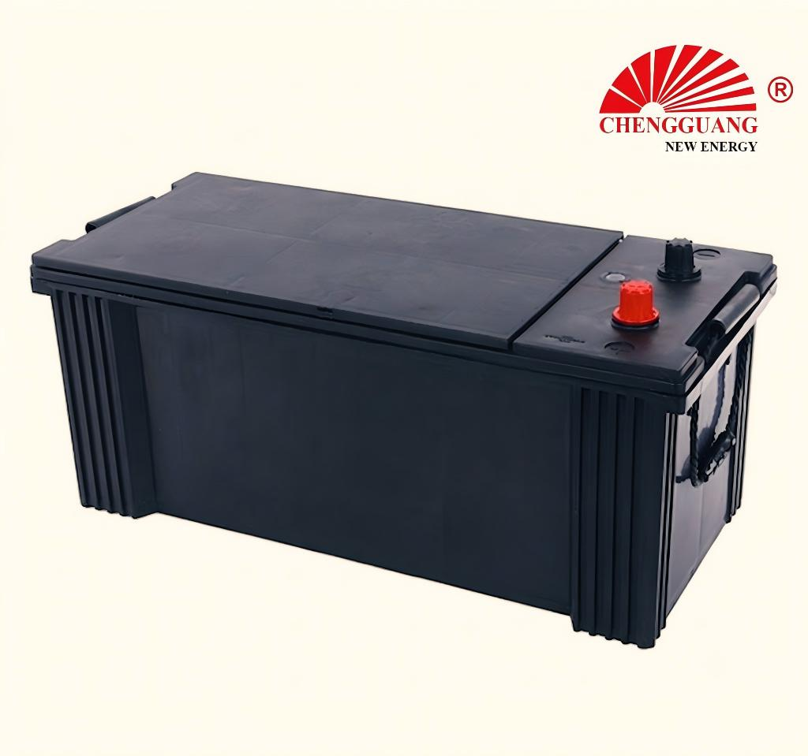

# 145G51 Battery — N150

The 145G51 (N150) is a heavy-duty JIS battery built for commercial vehicles — medium-duty trucks, large buses, construction equipment, and marine applications. Its thick positive plates (3.0+ mm) and lead-antimony grids deliver extreme vibration resistance and sustained high-current capability.

## Quick Reference

| Parameter | Specification |
|---|---|
| **Model** | 145G51 |
| **Also Known As** | N150 |
| **Standard** | JIS |
| **Battery Type** | Heavy Duty |
| **Nominal Voltage** | 12 V |
| **Capacity (C20)** | 120-135 Ah |
| **CCA Rating** | 800-900 A (SAE) |
| **Dimensions (LxWxH)** | 508 x 222 x 212-240 mm |
| **Terminal Type** | T1 large post |
| **Polarity** | Left (-), Right (+) — JIS [0] |
| **Hold-Down** | B00 (top frame) |
| **Approximate Weight** | 30-38 kg |
| **Chengguang SKU** | CG-JIS-145G51 |

!!! warning "Specification Ranges"
    Exact specifications vary by production batch and customer requirement. Contact Chengguang for your order's technical data sheet.

## How to Identify This Battery

Massive case (508 mm long x 222 mm wide). T1 large post terminals (O19.5mm/+). Label shows '145G51' or 'N150'. Weight (30-38 kg) is the most obvious identifier.

## Vehicle Applications

Medium-duty trucks, large buses, construction machinery, generators, marine starting. Diesel engines 4-8 liters.

### Compatible Vehicles

Isuzu F-Series/Forward, Hino 300/500, Fuso Canter/Fighter, UD Trucks, large buses, excavators, wheel loaders, agricultural tractors, marine diesel engines.

!!! note "Fitment Verification"
    Vehicle fitment is a general guide. Always verify tray dimensions, terminal position, and hold-down type.

## Regional Markets

Commercial vehicle aftermarket — global. Africa, Middle East, SE Asia are primary markets.

## Manufacturing at Chengguang

Heavy-duty dedicated line. Pb-Sb thick grids (3.0-3.5mm), deep sump design, double-sealed cover, reinforced COS straps. Output: 800-1,200 units/day.

## Testing & Quality Control

100%: CCA (SAE J537 at -18degC), OCV, high-rate discharge, visual. Batch: C20, RC, vibration (severe duty 5g), thermal cycling (-40degC to +70degC).

## Related Battery Models

- 190H52/N200 — larger heavy duty (521 x 278 mm, 200Ah)
- 105D31 — smaller SLI (306 mm, 90Ah)
- DIN100/60038 — large European battery (different dimensions)

## Equivalent Models & Cross-Reference

| Model | Standard | Relationship | Confidence |
|-------|----------|-------------|------------|
| **N150** | JIS | Alias / Same case | High |

!!! warning "Equivalent Does Not Mean Identical"
    Different model designations may indicate different specifications. Cross-standard equivalents are dimensional approximations only.

## OEM & Private Label Availability

Available for **OEM manufacturing** under your brand from Chengguang Power Tech (IATF 16949 certified):

[Request OEM Quote](https://chengguangenergy.com/contact/){ .md-button }

## Frequently Asked Questions

### 145G51 vs 190H52?

190H52 is larger (521 vs 508 mm length, 278 vs 222 mm width) with more capacity (200Ah vs 135Ah). 190H52 for heavy trucks. 145G51 for medium trucks and buses.

### Is N150 the same?

Yes — N150 is the Middle East/Africa designation. Same battery, same specifications.

### Can I use 145G51 in a passenger car?

No — physically too large (508 x 222 mm) and heavy (30+ kg). Passenger car battery trays cannot accommodate this size.

---

*Last verified: 2026-08-11 | Source: Chengguang Power Tech Co., Ltd. | SKU: CG-JIS-145G51 | Jinzhou, Hebei, China*

*Author: Chengguang Power Tech Technical Team | Reviewed: IATF 16949 Quality Department*
