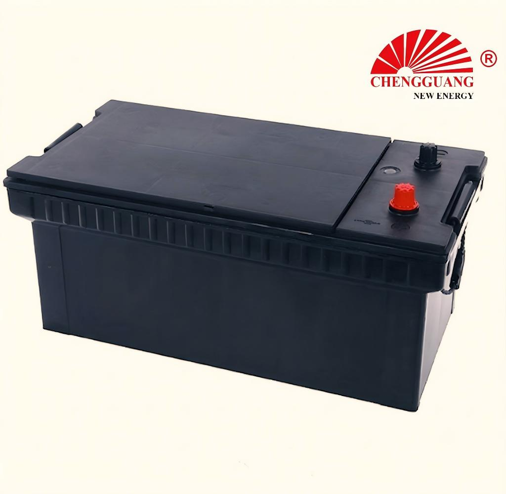

# 190H52 Battery — N200

The 190H52 (N200) is the largest, most powerful battery in the Chengguang range — 200Ah capacity and 1,100 CCA for heavy-duty trucks, large buses, earthmoving equipment, and stationary engines. Extra-thick plates (3.5-4.0mm) and massive lead content (45-55 kg) provide starting power for the largest diesel engines.

## Quick Reference

| Parameter | Specification |
|---|---|
| **Model** | 190H52 |
| **Also Known As** | N200 |
| **Standard** | JIS |
| **Battery Type** | Heavy Duty |
| **Nominal Voltage** | 12 V |
| **Capacity (C20)** | 200 Ah |
| **CCA Rating** | 1,100 A (SAE) |
| **Dimensions (LxWxH)** | 521 x 278 x 220-270 mm |
| **Terminal Type** | T1 large post |
| **Polarity** | Left (-), Right (+) — JIS type [0] |
| **Hold-Down** | B00 (top frame) |
| **Approximate Weight** | 45-55 kg |
| **Chengguang SKU** | CG-JIS-190H52 |

!!! warning "Specification Ranges"
    Values shown are typical ranges. Exact specifications vary by production batch. Contact Chengguang for your order's technical data sheet.

## How to Identify This Battery

Largest JIS case: 521 x 278 mm. T1 large post terminals. Label shows '190H52' or 'N200'. Weight (45-55 kg) is unmistakable — over 3x a standard car battery. Requires two-person handling or mechanical lift.

## Vehicle Applications

Heavy-duty trucks (>8L diesel), large buses and coaches, earthmoving equipment, stationary diesel generators, mining equipment. The most demanding starting applications.

### Compatible Vehicles

| **Heavy trucks** |  Tractor units (semi-trucks), dump trucks, concrete mixers |
| **Buses** |  City buses, intercity coaches |
| **Construction** |  Large excavators, dozers, graders, mining trucks |
| **Stationary** |  Large diesel generators (prime/standby power) |
| **Marine** |  Large commercial vessel starting |

!!! note "Fitment Verification"
    Vehicle fitment is a general guide based on market experience. Always verify your vehicle's battery tray dimensions, terminal position, and hold-down type before ordering.

## Regional Markets

Commercial vehicle aftermarket — global. Mining regions, major construction markets, fleet operators worldwide.

## Manufacturing at Chengguang

Heavy-duty line with extra-thick Pb-Sb grids (3.5-4.0mm). Massive deep sump design. Ribbed high-impact PP case. Heavy-duty COS and through-the-wall intercell welds for 1,100A current handling. Output: 500-800 units/day.

## Testing & Quality Control

100%: CCA (SAE J537, >1,100A), OCV, high-rate discharge, visual. Batch: C20, RC (300-400 min typical), severe vibration (5g/8hr), thermal cycling (-40degC to +70degC), deep cycle endurance (80% DoD).

## Related Battery Models

- 145G51/N150 — medium heavy duty (508 mm, 135Ah) for medium trucks
- DIN100/60038 — passenger car battery, not a replacement

## Equivalent Models & Cross-Reference

| Model | Standard | Relationship | Confidence |
|-------|----------|-------------|------------|
| **N200** | JIS | Alias / Same case | :material-check: High |

!!! warning "Equivalent Does Not Mean Identical"
    Different model designations may indicate different specifications. Cross-standard equivalents are dimensional approximations only.

## OEM & Private Label Availability

This model is available for **OEM manufacturing** under your brand from Chengguang Power Tech:

- IATF 16949:2016 certified manufacturing in Jinzhou, Hebei, China
- Custom label, case color, terminal type, and retail packaging
- Full batch traceability — raw material lot to shipping container
- 100% pre-shipment CCA and capacity testing with CoA
- DG-compliant export packaging (UN 2794 / Class 8)
- Technical data sheet, MSDS, and Certificate of Analysis per shipment

[Request OEM Quote](https://chengguangenergy.com/contact/){{ .md-button }} [View OEM Process](https://oem.chengguangenergy.com/oem-process/){{ .md-button }}

## Frequently Asked Questions

### 190H52 vs 145G51?

190H52 is larger (521x278 vs 508x222 mm), heavier (45-55 vs 30-38 kg), and more powerful (200Ah/1,100CCA vs 135Ah/900CCA). 190H52 for heavy trucks/equipment. 145G51 for medium trucks/buses.

### Is N200 the same?

Yes — N200 is the regional designation for 190H52.

### For 24V systems?

Use two 190H52 in series. Common configuration for heavy truck and equipment 24V starting systems.

### Handling and safety?

45-55 kg requires mechanical lift or two-person handling. Always wear PPE. Terminal covers during transport. Secure with B00 frame clamp.

---

*Last verified: 2026-08-11 | Source: Chengguang Power Tech Co., Ltd. | SKU: CG-JIS-190H52 | Manufactured in Jinzhou, Hebei, China*

*Author: Chengguang Power Tech Technical Team | Reviewed: IATF 16949 Quality Department | [Technical Reference](https://technical.chengguangenergy.com/)*
