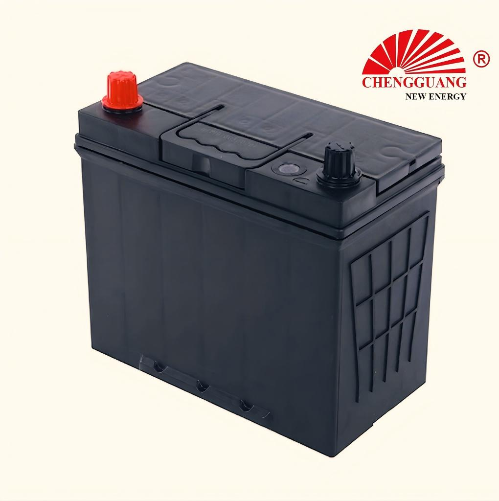

# 55B24 Battery — N45, N40

The 55B24 is the smallest JIS battery in the Chengguang range — a narrow-frame design (129 mm wide) for compact sedans, hatchbacks, and kei cars where battery tray space is limited. It delivers 45Ah and 370 CCA — adequate for 1.3L-1.6L gasoline engines in temperate to warm climates.

## Quick Reference

| Parameter | Specification |
|---|---|
| **Model** | 55B24 |
| **Also Known As** | N45, N40 |
| **Standard** | JIS |
| **Battery Type** | SLI |
| **Nominal Voltage** | 12 V |
| **Capacity (C20)** | 45 Ah |
| **CCA Rating** | 370 A (SAE) |
| **Dimensions (LxWxH)** | 238 x 129 x 202-227 mm |
| **Terminal Type** | T1 small post |
| **Polarity** | Left (-), Right (+) — JIS type [0] |
| **Hold-Down** | B00 (top frame) |
| **Approximate Weight** | 11-14 kg |
| **Chengguang SKU** | CG-JIS-55B24 |

!!! warning "Specification Ranges"
    Values shown are typical ranges. Exact specifications vary by production batch. Contact Chengguang for your order's technical data sheet.

## How to Identify This Battery

Narrow case: 129 mm width with T1 small post terminals. Much narrower than the D-series (173 mm). Label shows '55B24', 'N45', or 'N40'. Measure the width — if your tray is ~130 mm wide, you need a 55B24; if ~175 mm wide, you can upgrade to a D-series battery.

## Vehicle Applications

Small passenger cars, compact sedans, kei cars with 1.3L-1.6L gasoline engines.

### Compatible Vehicles

| **Toyota** |  Vios, Yaris, Agya, Avanza (some) |
| **Honda** |  City, Jazz, Brio, Mobilio |
| **Suzuki** |  Swift, Dzire, Alto |
| **Nissan** |  March, Almera, Note |
| **Daihatsu** |  Terios, Sirion, Xenia |
| **Mitsubishi** |  Mirage, Attrage |

!!! note "Fitment Verification"
    Vehicle fitment is a general guide based on market experience. Always verify your vehicle's battery tray dimensions, terminal position, and hold-down type before ordering.

## Regional Markets

Southeast Asia (Thailand, Indonesia, Philippines, Vietnam — highest volume), Africa (East/West — compact car segment), Middle East (small car segment), Oceania (light vehicles)

## Manufacturing at Chengguang

Small-frame automated line. Ca-Ca grid alloy. Reinforced thin-plate design for reliable starting within compact dimensions. Average: 3,000-4,000 units/day.

## Testing & Quality Control

100%: CCA (SAE J537 at -18degC, >370A), OCV (>12.60V), visual. Batch: C20, charge acceptance, vibration (JIS D 5301).

## Related Battery Models

- 55D23 — wider case (173 mm), higher capacity (60Ah). Upgrade if tray allows
- 65D26 — much larger (260 x 173 mm). Full-size upgrade for larger vehicles
- DIN66/56638 — European compact equivalent (verify terminals)

## Equivalent Models & Cross-Reference

| Model | Standard | Relationship | Confidence |
|-------|----------|-------------|------------|
| **N45** | JIS | Alias / Same case | :material-check: High |
| **N40** | JIS | Alias / Same case | :material-check: High |

!!! warning "Equivalent Does Not Mean Identical"
    Different model designations may indicate different specifications. Cross-standard equivalents are dimensional approximations only.

## OEM & Private Label Availability

This model is available for **OEM manufacturing** under your brand from Chengguang Power Tech:

- IATF 16949:2016 certified manufacturing in Jinzhou, Hebei, China
- Custom label, case color, terminal type, and retail packaging
- Full batch traceability — raw material lot to shipping container
- 100% pre-shipment CCA and capacity testing with CoA
- DG-compliant export packaging (UN 2794 / Class 8)
- Technical data sheet, MSDS, and Certificate of Analysis per shipment

[Request OEM Quote](https://chengguangenergy.com/contact/){{ .md-button }} [View OEM Process](https://oem.chengguangenergy.com/oem-process/){{ .md-button }}

## Frequently Asked Questions

### What vehicles use a 55B24?

Compact Japanese vehicles — Toyota Vios/Yaris, Honda City/Jazz, Suzuki Swift, Nissan March. Verify tray: 238 x 129 mm.

### Is 55B24 the same as N45 or N40?

Same physical case. N45 = 45Ah class, N40 = 40Ah class. Chengguang 55B24 rated 45Ah, covering both designations.

### Can I upgrade to a larger battery?

55D23 (173 mm wide) or 65D26 (260 x 173 mm) offer more capacity, but require wider/longer battery trays. Measure before upgrading.

### How long does a 55B24 last?

2-4 years depending on climate. Hot climates reduce life to 18-24 months. Regular charging system checks extend service life.

---

*Last verified: 2026-08-11 | Source: Chengguang Power Tech Co., Ltd. | SKU: CG-JIS-55B24 | Manufactured in Jinzhou, Hebei, China*

*Author: Chengguang Power Tech Technical Team | Reviewed: IATF 16949 Quality Department | [Technical Reference](https://technical.chengguangenergy.com/)*
