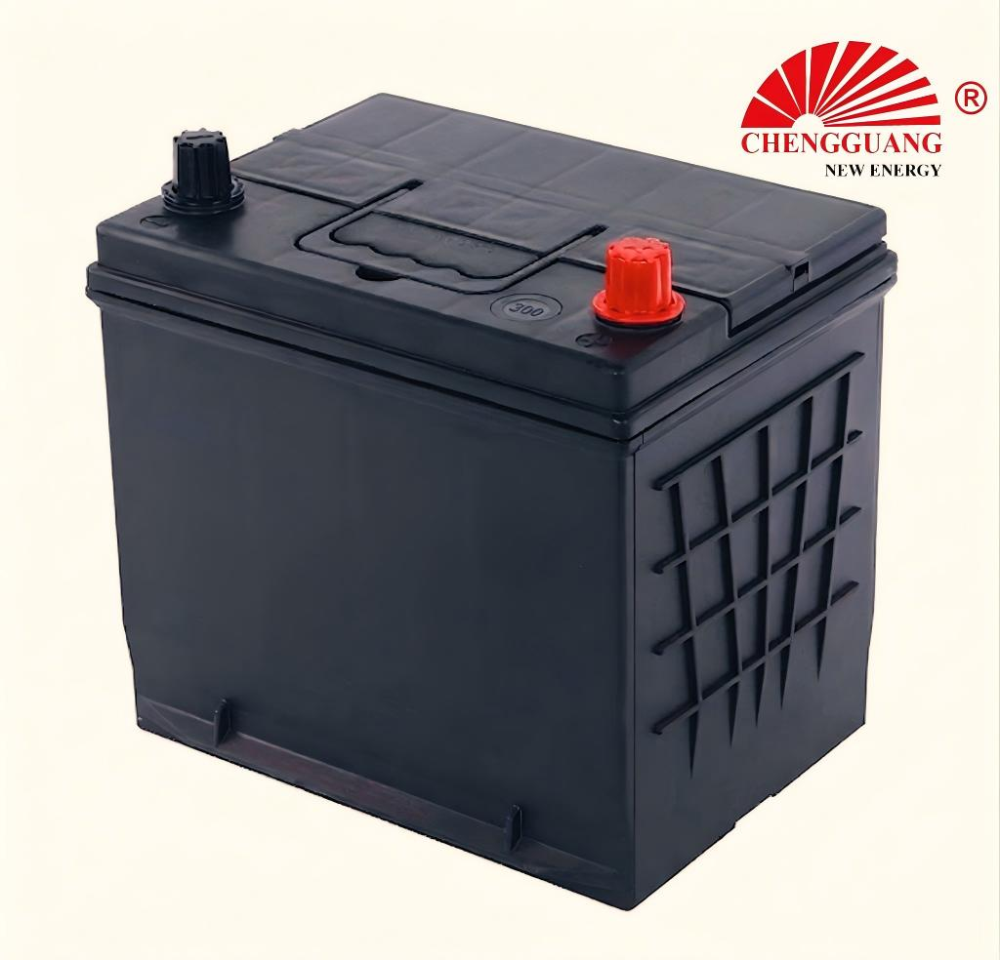

# 55D23 Battery — 75D23

The 55D23 is the mid-compact JIS battery — bridging the narrow 55B24 (129 mm) and the full-size 65D26 (260 mm). Its 232 mm length makes it shorter than the ubiquitous 65D26, fitting vehicles with tighter engine bay dimensions while delivering 60Ah and 500 CCA.

## Quick Reference

| Parameter | Specification |
|---|---|
| **Model** | 55D23 |
| **Also Known As** | 75D23 |
| **Standard** | JIS |
| **Battery Type** | SLI |
| **Nominal Voltage** | 12 V |
| **Capacity (C20)** | 60 Ah |
| **CCA Rating** | 500 A (SAE) |
| **Dimensions (LxWxH)** | 232 x 173 x 202-225 mm |
| **Terminal Type** | T1 small post |
| **Polarity** | Left (-), Right (+) — JIS type [0] |
| **Hold-Down** | B00 (top frame) |
| **Approximate Weight** | 13-16 kg |
| **Chengguang SKU** | CG-JIS-55D23 |

!!! warning "Specification Ranges"
    Values shown are typical ranges. Exact specifications vary by production batch. Contact Chengguang for your order's technical data sheet.

## How to Identify This Battery

Standard D-series width (173 mm) with a shorter 232 mm length — 28 mm shorter than the 65D26. Check label for '55D23' or '75D23'. The shorter length distinguishes it from the 65D26 in the same D-series family.

## Vehicle Applications

Compact-to-mid sedans with 1.6L-2.0L gasoline engines. Popular original equipment size for Toyota Corolla and Honda Civic.

### Compatible Vehicles

| **Toyota** |  Corolla/Altis (pre-2014), Vios (some markets) |
| **Honda** |  Civic (8th-9th gen), City (larger variants) |
| **Mazda** |  3, Axela |
| **Nissan** |  Sylphy/Sentra, Tiida |
| **Mitsubishi** |  Lancer, Lancer EX |

!!! note "Fitment Verification"
    Vehicle fitment is a general guide based on market experience. Always verify your vehicle's battery tray dimensions, terminal position, and hold-down type before ordering.

## Regional Markets

Southeast Asia (core market), Middle East, Africa (East/West), Oceania. Widely stocked by battery shops across developing markets.

## Manufacturing at Chengguang

D-series automated line. Ca-Ca grid alloy. Standard volume: 2,500-3,500 units/day. Shared tooling with 65D26 for D-series width components.

## Testing & Quality Control

100%: CCA (SAE J537, >500A), OCV, visual. Batch: C20, RC, charge acceptance (IEC 60095-1), vibration (JIS D 5301).

## Related Battery Models

- 55B24 — narrower (129 mm), lower capacity (45Ah)
- 65D26 — longer (260 mm), higher CCA (550A). Most common upgrade
- DIN70/57117 — European equivalent (verify hold-down: B13 vs B00)

## Equivalent Models & Cross-Reference

| Model | Standard | Relationship | Confidence |
|-------|----------|-------------|------------|
| **75D23** | JIS | Alias / Same case | :material-check: High |

!!! warning "Equivalent Does Not Mean Identical"
    Different model designations may indicate different specifications. Cross-standard equivalents are dimensional approximations only.

## OEM & Private Label Availability

This model is available for **OEM manufacturing** under your brand from Chengguang Power Tech:

- IATF 16949:2016 certified manufacturing in Jinzhou, Hebei, China
- Custom label, case color, terminal type, and retail packaging
- Full batch traceability — raw material lot to shipping container
- 100% pre-shipment CCA and capacity testing with CoA
- DG-compliant export packaging (UN 2794 / Class 8)
- Technical data sheet, MSDS, and Certificate of Analysis per shipment

[Request OEM Quote](https://chengguangenergy.com/contact/){{ .md-button }} [View OEM Process](https://oem.chengguangenergy.com/oem-process/){{ .md-button }}

## Frequently Asked Questions

### 55D23 vs 65D26: which should I buy?

If your tray is 232 mm: 55D23. If 260 mm: 65D26 (higher CCA, more common, often cheaper per Ah). Measure before buying.

### Is 75D23 the same as 55D23?

Same case. 75D23 typically indicates 75Ah class vs 60Ah for 55D23. Verify the Ah rating on the label.

### What vehicles use 55D23?

Toyota Corolla (pre-2014), Honda Civic (8-9th gen), Mazda 3. Many Japanese compact-mid sedans use this size.

---

*Last verified: 2026-08-11 | Source: Chengguang Power Tech Co., Ltd. | SKU: CG-JIS-55D23 | Manufactured in Jinzhou, Hebei, China*

*Author: Chengguang Power Tech Technical Team | Reviewed: IATF 16949 Quality Department | [Technical Reference](https://technical.chengguangenergy.com/)*
