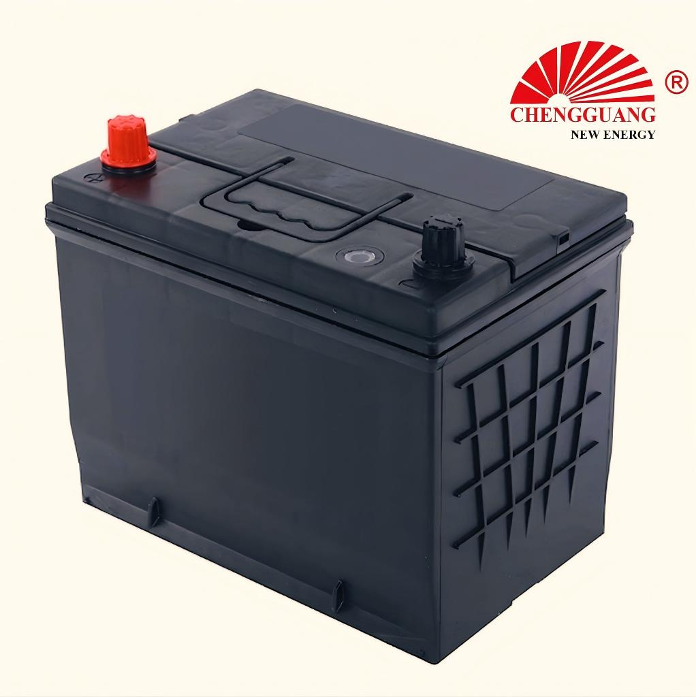

# 65D26 Battery — 55D26 / NS70 / N50 / N50Z

65D26 (55D26/NS70/N50/N50Z) is a **JIS SLI** automotive battery specification.

## Technical Specifications

| Parameter | Specification |
|---|---|
| **Model** | 65D26 |
| **Aliases** | 55D26, NS70, N50, N50Z |
| **Standard** | JIS |
| **Battery Type** | SLI |
| **Nominal Voltage** | 12 V |
| **Capacity (C20)** | 55-70 Ah |
| **CCA Rating** | 450-580 A (SAE) |
| **Dimensions (LxWxH)** | 260 x 173 x 202-225 mm |
| **Terminal Type** | T1 (JIS small post) |
| **Polarity** | L- R+ [0] |
| **Hold-Down** | B00 |
| **Approximate Weight** | 14-18 kg |

!!! warning "Data Verification: RANGE_ONLY"
    Specifications are provided as ranges. Exact per-unit values should be confirmed with the manufacturer.

## Applications

Mid-to-large sedans, SUVs, light pickups - highest-volume model globally

### Vehicle Fitment

Toyota Camry/RAV4/Fortuner, Honda CR-V/Accord, Nissan X-Trail/Teana, Mazda CX-5, Mitsubishi Pajero Sport

## Markets

Africa, Middle East, Southeast Asia, Australia

## Equivalent Models

| Model | Standard | Relationship | Confidence |
|-------|----------|-------------|------------|
| **55D26** | JIS | Alias | High |
| **NS70** | JIS | Alias | High |
| **N50** | JIS | Alias | High |
| **N50Z** | JIS | Alias | High |

!!! note "Equivalent != Identical"
    Different model designations may indicate different specifications (capacity, CCA) even within the same case size. Always verify specifications before substituting.

## OEM Availability

This model is available for **OEM / private label manufacturing** from Chengguang Power Tech.

- IATF 16949 certified manufacturing
- Custom label, packaging, and terminal options
- Full batch traceability
- Pre-shipment inspection with CCA and capacity testing

[Request OEM Quote](https://chengguangenergy.com/contact/)

---

*Last verified: 2026-08-11 | Source: Chengguang Power Tech product documentation | SKU: CG-JIS-65D26*
