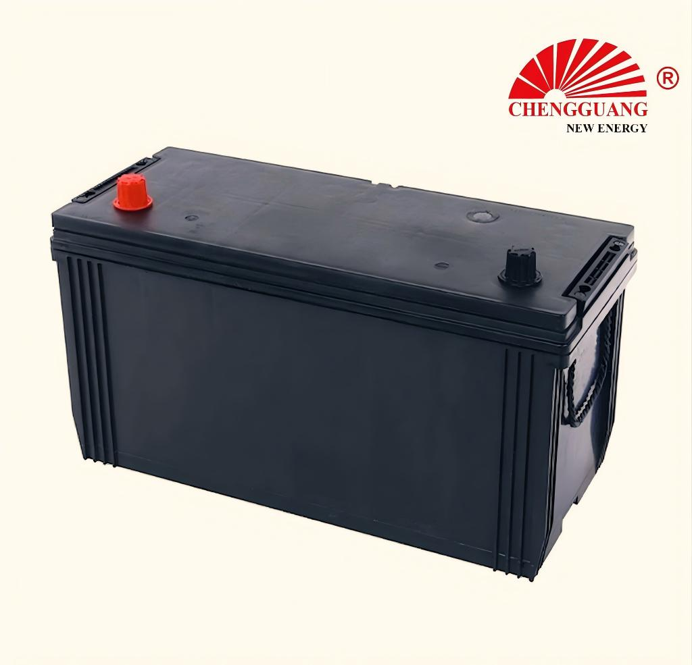

# 95E41 Battery — W105, N100

The 95E41 is a high-capacity JIS battery — 100Ah and 750 CCA in an extra-long 410 mm case. Designed for large SUVs, light trucks, and diesel vehicles requiring substantial starting power and reserve capacity. Significantly larger than the D-series: 150 mm longer than 65D26.

## Quick Reference

| Parameter | Specification |
|---|---|
| **Model** | 95E41 |
| **Also Known As** | W105, N100 |
| **Standard** | JIS |
| **Battery Type** | SLI |
| **Nominal Voltage** | 12 V |
| **Capacity (C20)** | 100 Ah |
| **CCA Rating** | 750 A (SAE) |
| **Dimensions (LxWxH)** | 410 x 176 x 213-233 mm |
| **Terminal Type** | T1 small post |
| **Polarity** | Left (-), Right (+) — JIS type [0] |
| **Hold-Down** | B00 (top frame) |
| **Approximate Weight** | 22-26 kg |
| **Chengguang SKU** | CG-JIS-95E41 |

!!! warning "Specification Ranges"
    Values shown are typical ranges. Exact specifications vary by production batch. Contact Chengguang for your order's technical data sheet.

## How to Identify This Battery

Extra-long case (410 mm) with T1 small terminals. Label shows '95E41', 'W105', or 'N100'. The 410 mm length is unmistakable — nearly twice the length of a 55B24. T1 small post terminals (not large T1).

## Vehicle Applications

Large SUVs, light trucks, diesel vehicles. Applications requiring 100Ah+ capacity for high electrical loads or extended accessory use.

### Compatible Vehicles

| **Toyota** |  Land Cruiser (70/80/100/200 series), Land Cruiser Prado (diesel) |
| **Nissan** |  Patrol (Y61/Y62), Safari |
| **Lexus** |  LX series |
| **Large diesel SUVs and pickups requiring high CCA** |  |

!!! note "Fitment Verification"
    Vehicle fitment is a general guide based on market experience. Always verify your vehicle's battery tray dimensions, terminal position, and hold-down type before ordering.

## Regional Markets

Africa (major market — #2 after 65D26), Middle East (large SUV segment), Southeast Asia (diesel SUV market), Oceania

## Manufacturing at Chengguang

Large-frame production line. Ca-Ca alloy with reinforced plate design for deep discharge tolerance. Heavier grids than D-series. Output: 1,500-2,000 units/day.

## Testing & Quality Control

100%: CCA (SAE J537, >750A), OCV, high-rate discharge, visual. Batch: C20, RC, charge acceptance, vibration (severe duty), thermal cycling (-30degC to +60degC).

## Related Battery Models

- 65D26 — much smaller (260 mm), lower capacity (65Ah). Not a direct replacement
- 105D31 — shorter (306 mm), similar capacity (90Ah). Different fitment
- DIN100/60038 — European 100Ah equivalent (393 mm, B13 hold-down)
- 58827/DIN88 — 88Ah European large battery

## Equivalent Models & Cross-Reference

| Model | Standard | Relationship | Confidence |
|-------|----------|-------------|------------|
| **W105** | JIS | Alias / Same case | :material-check: High |
| **N100** | JIS | Alias / Same case | :material-check: High |

!!! warning "Equivalent Does Not Mean Identical"
    Different model designations may indicate different specifications. Cross-standard equivalents are dimensional approximations only.

## OEM & Private Label Availability

This model is available for **OEM manufacturing** under your brand from Chengguang Power Tech:

- IATF 16949:2016 certified manufacturing in Jinzhou, Hebei, China
- Custom label, case color, terminal type, and retail packaging
- Full batch traceability — raw material lot to shipping container
- 100% pre-shipment CCA and capacity testing with CoA
- DG-compliant export packaging (UN 2794 / Class 8)
- Technical data sheet, MSDS, and Certificate of Analysis per shipment

[Request OEM Quote](https://chengguangenergy.com/contact/){{ .md-button }} [View OEM Process](https://oem.chengguangenergy.com/oem-process/){{ .md-button }}

## Frequently Asked Questions

### 95E41 vs 105D31: which for my vehicle?

Measure your tray. 95E41 fits 410 mm trays. 105D31 fits 306 mm trays. Both ~90-100Ah class. Not interchangeable.

### Is N100 the same as 95E41?

Yes — N100 is the Middle East/Africa designation. Both indicate 100Ah class. Same battery, different label.

### What diesel vehicles use 95E41?

Toyota Land Cruiser (diesel), Nissan Patrol (diesel). Large displacement diesel SUVs requiring 750+ CCA for cold starts.

### Can 95E41 be used for trucks?

Not recommended. For commercial trucks, use heavy-duty models (145G51, 190H52) with thicker plates and vibration resistance.

---

*Last verified: 2026-08-11 | Source: Chengguang Power Tech Co., Ltd. | SKU: CG-JIS-95E41 | Manufactured in Jinzhou, Hebei, China*

*Author: Chengguang Power Tech Technical Team | Reviewed: IATF 16949 Quality Department | [Technical Reference](https://technical.chengguangenergy.com/)*
